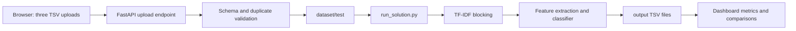

# EntityForge-BER

**Business Entity Resolution Dashboard and ML Pipeline**

EntityForge-BER matches fragmented company records from Source 2 and Source 3 against the Source 1 reference dataset. It includes a precision-oriented matching pipeline and a responsive FastAPI dashboard for uploads, analytics, search, comparison, and TSV exports.

## Highlights

- One reference file matched against any number of comparison files (1-to-N)
- Character n-gram TF-IDF blocking: only the top 15 candidates per record are scored
- Pairwise name, address, country, token and fuzzy-similarity features (RapidFuzz, with a difflib fallback)
- LightGBM classifier with a scikit-learn fallback
- Training-based F0.5 threshold selection for precision-first matching
- Runs in-process, so it works on Vercel's serverless runtime
- Dark, responsive dashboard with side-by-side comparisons, search and one-click TSV downloads

## Project layout

```text
EntityForge-BER/
├── entity_resolver_app.py       # FastAPI app with the embedded dashboard
├── vercel.json                  # Vercel Python function and route configuration
├── requirements.txt             # Minimal Vercel dependency set
├── run_solution.py              # ML matching pipeline
├── check.py                     # Convenience submission validator
├── requirements-dashboard.txt   # Dashboard/runtime dependencies
├── dataset/
│   ├── train/                   # Training sources and ground truth
│   └── test/                    # Current Source 1/2/3 input files
├── output/                      # Generated candidate and match TSV files
└── utils/validate_submission.py # Output format validation
```

## Setup

Use Python 3.11+ from the repository root. Install the dependencies with:

```powershell
python -m pip install -r requirements-dashboard.txt
```

## Run the ML pipeline

```powershell
python run_solution.py
python check.py
```

The pipeline writes:

- `output/candidate_pairs.tsv`
- `output/matching_results.tsv`

## Run the web dashboard

```powershell
python -m uvicorn entity_resolver_app:app --reload
```

Open `http://127.0.0.1:8000` in a browser. Locally, uploads and outputs from the dashboard go to `.runtime/` (ignored by git).

## Deploy to Vercel

The Vercel function treats the repository as read-only. Uploads are written to `/tmp/uploads` and generated outputs to `/tmp/output`; the training dataset and application code remain read-only package assets.

Deploy from the repository root with the Vercel CLI:

```powershell
npx vercel
npx vercel --prod
```

Or import `Karthikch05-dev/EntityForge-BER` in the Vercel dashboard. The included `vercel.json` routes all requests to `entity_resolver_app.py`. For serverless builds, Vercel installs `requirements.txt`; use `requirements-dashboard.txt` for local development with Uvicorn and optional LightGBM.

### Upload workflow

1. **Reference file** — upload exactly one TSV/CSV (Source 1).
2. **Comparison files** — upload one or more TSV/CSV files (Source 2, Source 3, …).
3. **Results** — select **Run matching** and review each reference record next to its matches, then download `matching_results.tsv` and `candidate_pairs.tsv`.

Every file needs the headers `entity_id`, `business_name`, `business_address` and `country`; the dashboard checks them as soon as a file is added. If two comparison files reuse the same IDs, the clashing file's IDs are prefixed with its file name. Uploads are limited to 25 MB per file. **Try with sample data** runs the bundled `dataset/test` files.

### API

| Method | Path | Body |
| --- | --- | --- |
| `POST` | `/api/resolve` | multipart: `reference` (one file), `targets` (one or more files) |
| `POST` | `/api/resolve/sample` | — runs the bundled sample data |
| `GET` | `/download/matching`, `/download/candidates` | latest outputs stored on that server instance |
| `GET` | `/health` | engine status and model in use |

## Git setup

Initialize the local repository and create the first commit:

```powershell
git init
git add .
git commit -m "Add EntityForge BER pipeline and dashboard"
git branch -M main
```

Create an empty GitHub repository named `EntityForge-BER`, then replace `YOUR_USERNAME` below with your GitHub username:

```powershell
git remote add origin https://github.com/YOUR_USERNAME/EntityForge-BER.git
git push -u origin main
```

## Architecture



## Notes

- No external business lookup or enrichment API is used.
- Country labels are treated as open-set strings.
- `F0.5` prioritizes precision to reduce false merges.
