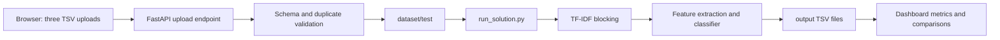

# EntityForge-BER

**Business Entity Resolution Dashboard and ML Pipeline**

EntityForge-BER matches fragmented company records from Source 2 and Source 3 against the Source 1 reference dataset. It includes a precision-oriented matching pipeline and a responsive FastAPI dashboard for uploads, analytics, search, comparison, and TSV exports.

## Highlights

- Character n-gram TF-IDF candidate generation
- Pairwise name, address, country, token, and similarity features
- LightGBM classifier with a scikit-learn fallback
- Training-based F0.5 threshold selection
- Dynamic browser upload of any three valid TSV files
- Atomic upload replacement and rollback when a pipeline run fails
- Dark-slate responsive dashboard with charts and table/card views
- Downloadable `matching_results.tsv` and `candidate_pairs.tsv`

## Project layout

```text
EntityForge-BER/
├── entity_resolver_app.py       # FastAPI application and embedded dashboard
├── vercel.json                  # Vercel Python function and route configuration
├── requirements.txt             # Minimal Vercel dependency set
├── run_solution.py              # ML matching pipeline
├── check.py                     # Convenience submission validator
├── requirements-dashboard.txt   # Dashboard/runtime dependencies
├── dataset/
│   ├── train/                   # Training sources and ground truth
│   └── test/                    # Current Source 1/2/3 input files
├── output/                      # Generated candidate and match TSV files
└── utils/validate_submission.py # Output format validation
```

## Setup

Use Python 3.11+ from the repository root. Install the dependencies with:

```powershell
python -m pip install -r requirements-dashboard.txt
```

## Run the ML pipeline

```powershell
python run_solution.py
python check.py
```

The pipeline writes:

- `output/candidate_pairs.tsv`
- `output/matching_results.tsv`

## Run the web dashboard

```powershell
python -m uvicorn entity_resolver_app:app --reload
```

Open `http://127.0.0.1:8000` in a browser. API documentation is available at `http://127.0.0.1:8000/docs`.

## Deploy to Vercel

The Vercel function treats the repository as read-only. Uploaded test files and generated outputs are written to `/tmp/entityforge-ber`; the training dataset and application code remain read-only package assets.

Deploy from the repository root with the Vercel CLI:

```powershell
npx vercel
npx vercel --prod
```

Or import `Karthikch05-dev/EntityForge-BER` in the Vercel dashboard. The included `vercel.json` routes all requests to `entity_resolver_app.py`. For serverless builds, Vercel installs `requirements.txt`; use `requirements-dashboard.txt` for local development with Uvicorn and optional LightGBM.

### Upload workflow

1. Select one TSV for each Source 1, Source 2, and Source 3 zone.
2. Each file must contain `entity_id`, `business_name`, `business_address`, and `country`.
3. The dashboard validates file type, size, schema, and duplicate IDs.
4. The three files are saved to `dataset/test/` and the pipeline runs automatically.
5. The dashboard reloads with fresh metrics and comparisons.

Uploads are limited to 25 MB per file. Failed runs restore the previous inputs and outputs.

## Git setup

Initialize the local repository and create the first commit:

```powershell
git init
git add .
git commit -m "Add EntityForge BER pipeline and dashboard"
git branch -M main
```

Create an empty GitHub repository named `EntityForge-BER`, then replace `YOUR_USERNAME` below with your GitHub username:

```powershell
git remote add origin https://github.com/YOUR_USERNAME/EntityForge-BER.git
git push -u origin main
```

## Architecture



## Notes

- No external business lookup or enrichment API is used.
- Country labels are treated as open-set strings.
- The dashboard uses ApexCharts from a CDN when available and shows a graceful fallback if the CDN cannot be reached.
- `F0.5` prioritizes precision to reduce false merges.
